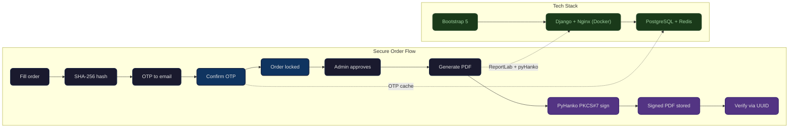
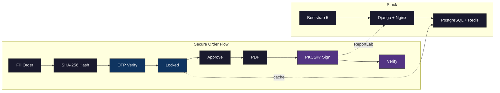

# ZarlyOS — Poster Architecture Diagram

Copy the ` ```mermaid ` block below into [mermaid.live](https://mermaid.live) or your AI agent.



> **Color legend:** Dark boxes = user actions · Blue boxes = security anchors · Purple boxes = cryptographic integrity · Green boxes = infrastructure

---

## What to tweak for your poster

| Thing | How |
|-------|-----|
| **Colors** | Replace the hex values in `classDef` to match your poster palette |
| **Icons** | Swap the emoji for your own icons if rendering in Figma/Illustrator |
| **Labels** | Each box is `"icon<br/>Title<br/>subtitle"` — keep under 5 words |
| **Stack detail** | Add Nginx, Stripe, or Docker labels to the bottom tier if you want more detail |
| **Font** | mermaid.live supports `%%{init: {'themeVariables': { 'fontFamily': '...' }}}%%` at the top |

---

## Even simpler (if space is tight)


