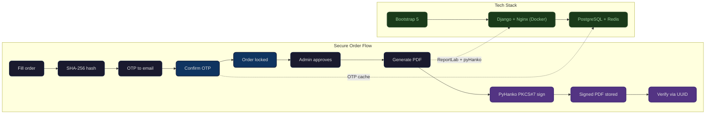

# ZarlyOS — FYP Poster Content

**Project:** Secure Signature-Based Online Ordering System for Zarly BigFood Sdn Bhd
**Student:** Rusdi Bin Abd Rashid (AI230025)
**Supervisor:** Dr Sofia Najwa Binti Ramli
**University:** Universiti Tun Hussein Onn Malaysia (UTHM)
**Academic Year:** 2025/2026 | **Field:** Cybersecurity

---

## 1. DESCRIPTION

ZarlyOS is a secure signature-based online ordering system built for **Zarly BigFood Sdn Bhd**, replacing informal order intake through WhatsApp, Instagram DMs, and verbal agreements with a centralized, tamper-proof digital platform. Every customer order is bound by a **SHA-256 commitment hash** at submission and confirmed via **cryptographic OTP** (time-limited, single-use), establishing non-repudiation of origin. Once a sales administrator approves the order, the system generates a PDF invoice and embeds a **PyHanko PKCS#7 digital signature** using the company's X.509 certificate, establishing non-repudiation of finalization. This two-party non-repudiation model — grounded in **ITU-T X.813 / RFC 2828** and aligned with Malaysia's **Electronic Commerce Act 2006** and **Digital Signature Act 1997** — ensures neither the customer nor the company can deny a transaction after the fact. The system is deployed on a **Django 5.1 + PostgreSQL 17 + Redis 7 + Nginx** stack inside Docker containers, served over HTTPS at **zarlybigfood.my**.

---

## 2. NOVELTY

- **Two-party non-repudiation model (NRO + NRF):** The system cryptographically binds both parties — the customer via OTP-confirmed SHA-256 commitment hash (Non-Repudiation of Origin) and the company via PyHanko PKCS#7 digital signature on the approved PDF (Non-Repudiation of Finalization). This is a formal security architecture rarely found in food ordering platforms.
- **Visually verifiable tamper-proof receipts:** Every receipt download is dynamically watermarked based on a live SHA-256 integrity check. A green "AUTHENTIC" seal with pantograph security background means the receipt is genuine and unmodified. A red "VOID" stamp means tampering was detected. Anyone — customer, auditor, or third party — can judge authenticity at a glance without needing to understand hashes or cryptography. Public verification is available at a UUID-based URL (`/verify/<uuid>/`) for recipients who receive the receipt from someone else and want to re-download a verified copy.
- **Hash-chained immutable audit trail:** Every admin action — login, approval, rejection, refund, receipt verification — is recorded in an `AuditLog` where each row's `chain_hash = SHA-256(previous_hash | actor | action | target | metadata | ip)`. The `verify_chain()` class method can detect any tampering across the entire history.
- **Live tamper detection on receipt download:** Every time a signed receipt PDF is downloaded, the system recomputes its SHA-256 hash and compares it against the stored `DigitalSignature.signature_hash`. If they match, a green "AUTHENTIC" pantograph watermark is applied; if tampered, a red "VOID" stamp is applied instead. The original file on disk is never modified.

---

## 3. SOCIETAL BENEFITS

- **Replaces informal, legally weak order intake:** Malaysian F&B SMEs like Zarly BigFood previously relied on WhatsApp messages, Instagram DMs, and verbal agreements for orders — none of which provide auditable proof of transaction. This system replaces all of that with a single platform where every order carries cryptographic evidence of both customer intent and company acceptance.
- **Provides legal proof for dispute resolution:** In the event of a customer disputing an order ("I didn't order this," "the price was different"), the commitment hash proves the exact contents the customer confirmed via OTP, and the PKCS#7-signed PDF proves the company approved those contents. Both pieces of evidence are independently verifiable without access to the live database.
- **Professionalizes SME operations at low cost:** The system runs on a ~$13/month AWS Lightsail VPS with Docker Compose, making enterprise-grade cryptographic integrity accessible to a small food business that cannot afford commercial e-signature solutions or legal document management systems.
- **Protects both parties equally:** Unlike standard e-commerce platforms where the platform holds all the evidence, this system gives customers their own verifiable receipt (downloadable signed PDF with UUID verification URL), so neither party is dependent on the other to prove what happened.
- **Supports Malaysian payment infrastructure:** Integrates both international card payments (Stripe) and Malaysian domestic payment methods (DuitNow QR, bank transfer with manual proof upload), making it practical for the local F&B market.

---

## 4. UNIQUENESS

- **Two-party non-repudiation with distinct cryptographic mechanisms per party:** Customer side uses OTP + SHA-256 commitment hash (because consumers lack PKI certificates); company side uses PyHanko PKCS#7 with X.509 certificate. This is a deliberate architectural choice grounded in ITU-T X.813. The design spec explicitly maps NRO and NRF to different evidence types and covers all four dispute scenarios.
- **Hash-chained audit log with `verify_chain()`:** The `AuditLog` model implements a blockchain-like SHA-256 chain across 30+ action types. A single class method call can verify the integrity of the entire audit history. Genesis hash: `SHA-256("ZARLY_AUDIT_CHAIN_V1")`. Row-level race-condition protection uses `select_for_update()` within `transaction.atomic()`.
- **Private media serving via X-Accel-Redirect with ownership verification:** Sensitive files (payment proofs, signed PDFs, complaint evidence) are blocked at Nginx level (`deny all`) and served exclusively through Django's authenticated `/files/<path>` endpoint. Customers can only access files they own; Nginx's `X-Accel-Redirect` internal directive handles zero-copy file streaming after Django authorizes.
- **Fernet-encrypted support chat at rest:** All `SupportMessage` bodies are stored as Fernet ciphertext (AES-128-CBC + HMAC-SHA256) in the database. Messages are encrypted on write and decrypted on read. Tampered ciphertext is detected and displayed as `[encrypted]`. The model's `delete()` method raises `PermissionError` — messages are immutable for non-repudiation of support communications.
- **Watermarked receipt with live tamper detection:** Every receipt download triggers a real-time SHA-256 integrity check. The PDF is dynamically stamped with a pantograph security background and a coloured seal — green "AUTHENTIC" if genuine, red "VOID" if tampered. The pantograph micro-text pattern ("ZARLY BIGFOOD SDN BHD" repeated at 35 degrees) visibly breaks apart if the document is photocopied or scanned.

---

## 5. STATUS OF PRODUCT

The system is **live and operational** at [zarlybigfood.my](https://zarlybigfood.my), deployed on an AWS Lightsail VPS (Ubuntu 24.04, $12/month plan) using Docker Compose with four containers: Nginx (SSL termination via Let's Encrypt, TLS 1.2/1.3, HSTS), Django 5.1 with Gunicorn, PostgreSQL 17, and Redis 7. The deployment includes CSP with per-request nonces, rate limiting (10 req/s general, 30 req/m API), private media blocking at the reverse-proxy level, session timeout (1-hour inactivity), and step-up authentication (sudo) for sensitive manager actions. **User Acceptance Testing (UAT) was conducted with 26 participants (18 customers, 8 staff).** The test suite contains **262+ pytest-django tests** across 14 test files, including dedicated test classes for non-repudiation, stock race conditions, security fixes, CSP, support chat encryption, delivery utilities, and database performance.

---

## 6. SYSTEM ARCHITECTURE FLOW

Each step is 5 words or fewer — suitable for a flowchart on the poster.

| Step | Label |
|------|-------|
| 1 | Customer fills order |
| 2 | Stock locked atomically (row-level) |
| 3 | SHA-256 commitment hash computed |
| 4 | OTP sent to email |
| 5 | Customer confirms OTP |
| 6 | Admin reviews and verifies payment |
| 7 | Admin approves, PDF generated |
| 8 | PyHanko signs PDF (PKCS#7) |
| 9 | Signed PDF stored + UUID issued |
| 10 | Customer downloads watermarked receipt |

**Tech stack (3 tiers):**

```
Browser (Bootstrap 5)  →  Django + Nginx (Docker)  →  PostgreSQL + Redis
```

---

## 7. THREE BEST SCREENSHOTS

| # | Page | Path | Why |
|---|------|------|-----|
| **1** | **Watermarked Receipt PDF** | `/menu/order/<id>/receipt/` | The most visually distinctive output. Shows the green "AUTHENTIC" diagonal seal, pantograph micro-text background, and "Digitally Signed · PKCS#7 · Tamper-Proof" subtitle. A single image communicates the entire security contribution. |
| **2** | **Landing Page** | `/start/` | The most polished UI. Dark navy/orange split hero with serif headline, 4-column feature strip, best-sellers grid. Shows the system is production-grade and customer-facing. |
| **3** | **Sales Admin Dashboard** | `/dashboard/` | The operational command centre. Dark metric strip with large orange numbers, order tables with status pills, accept/reject action buttons. Demonstrates a real operational tool handling live orders — not a prototype. |

---

## 8. MERMAID ARCHITECTURE DIAGRAM

For the poster — compact, no emoji, left-to-right flow:



> **Colour legend:** Dark boxes = user actions · Blue boxes = security anchors · Purple boxes = cryptographic integrity · Green boxes = infrastructure

---
*Generated from project files: CLAUDE.md, PROJECT_CONTEXT.md, PRODUCT.md, admins/utils.py, admins/models.py, customers/views.py, customers/otp_utils.py, nonrepudiation-order-signing-design.md, and related source files.*
